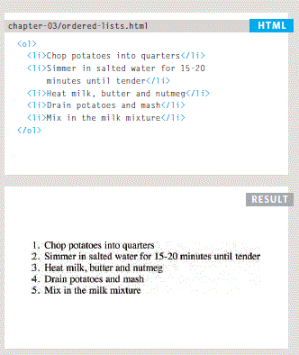
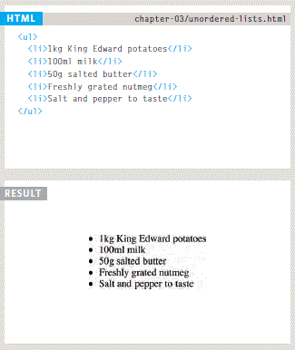
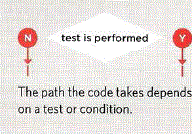
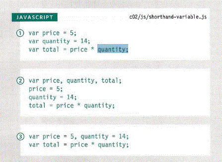

# chapter 3 : LIST

- what is the List ? 
the list is a group of items or set of terms.
- the list divided into three typs :

**1-** Ordered list: each item in the list is numbered.
The ordered list is created with the `<ol>` element.

**2-** UnOrdered list: lists that begin with a bullet point (rather than characters that indicate order).
The ordered list is created with the `<ul>` element.
* each item in the list is placed between an opening `<li>` tag
and a closing `</li>` tag.

**3-** Definition list: The definition list is created with the element, and usually consists of a series of terms and their definitions.
list is created with the `<dl>` element and usually consists of a series of terms and their definitions.
`<dt>` This is used to contain the term being defined, and `<dd>`is used to contain the definition.

- Nested List: You can put a second list inside an `<li>` element to create a sublist (nested list). so lists can be nested inside one another!

# Chapter 13 : Boxes

- **Box dimentions:**

By default, a box is sized just big enough to hold its contents, and if you need to set your own dimensions for a box you can use the height and width properties.

- **limiting height:**

In the same way that you might want to limit the width of a box on a page, you may also want to limit the height, iy's done by using the min-height and max-height properties.

- **border width:**

This property is used to control the width of a border, The value can either be in pixels or using one of this values: **thin** ,**medium** ,**thick**.

- **border images:**

This property applies an image to the border of any box, it takes a background image and divided it into 9 parts.

**border-style:**

to control the style of a border, this property This property can take the following values:
**solid** a single solid line.
**dotted** a series of square dots.
**ridge** appears to stick out from the page.
**inset** appears embedded into the page.
**outset** looks like it is coming out of the screen.
**hidden** or **none** no border is shown.
*You can individually change the styles of different borders using:*
**border-top-style**
**border-left-style**
**border-right-style**
**border-bottom-style**
- Padding:
* what is the padding? it's specify how much space should appear between the content of an element and its border, the value of this property is often in pixels.
- Margin:
* what ia the margin? it's specify the gap between boxes, its value is given in pixels, you can also use percentages.
## **PART TWO **
# Chapter 2: Basic JavaScript Instructions

Boolean variable can only have a value of true or fa1se.

* there are three ways of how to declare variables and assign them values:

1. Variables are declared and values assigned in the same statement.

2. Three variables are declared on the same line, then values assigned to each.

3. Two variables are declared and assigned values on the sameline, then one is declared and assigned a value on the next line.

# Chapter 4: Decisions and Loops switch statements:
- **arrays:** is a special type of variable, it doesn't just store one value, it stores a list of values.

- **switch statement:** it start with a variable called the switch value, each case indicates a possible value for this variable and the code that should run if the variable matches that value, and in each case we put `break` statments and may be we need a default case in switch statment.
* conditional statements allow your code to make decisions about what to do next.
* comparison operators ===, ! ==, ==, ! =, <, >, <=, => are used to compare two different operands.

