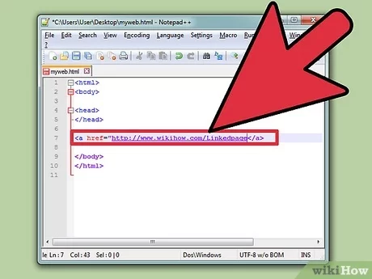

# Chapter 4: Links
 
links allow you to move from one web page to another.
* types of links:

**1-** Links from one website to another

**2-** Links from one page to another on the **same** website

**3-** Links from one part of a web page to another part of the same page

**4-** Links that open in a new browser window

**5-** Links that start up your email program and address a new email to someone else

* How we can insert links?
Links are created using the `<a>`.
 so you can click on anything between the opening `<a>` tag and the closing `</a>` tag You determine the page that you want to link by using the `href` attribute!

  **for Example**</spain>

 

 The text between `<a>` tag is known as **link text**, Clear link text (meaningful) can help visitors find what they want, and will give them more positive impression of your site and may motivates them to visit your site for longer,so to write a good link text, you can think of words that people may use when searching for the page that you are linking to.

The value of `href` attribute is the page that you want people to go to, when they click on the link, so when you link to a different website the value of the href
attribute will be equal to full web address for the site, which is known as an **Absolute URL**,it is start with the domain name for the site, and can be followed by the path to a specific page, if no page is specified, the site will display the
homepage for that site.

for now, **What is the URL stand for??**

*U*niform *R*esource *L*ocator, Every web page has its unique URL, this is the web address that you would type into a browser if you wanted to visit that specific page.

### **Linking to Other Pages on the Same Site**

* case One:

if you need to link to other pages in the same site, you don't need to specify the
domain name in the URL, juat you should use a shorthand which is **(relative URL)**.

**What is the relative URL?**

a shorthand version from absolute URLs because you don't need to specify the domain name, and it help when building a site on your computer because you can create links between pages without having to set up your domain name.

* case Two:

If all page of the site are in the same folder, then the value
of the href attribute is just the name of the file.

* case Three:

If you have different page of a site in different folders, then you use complex syntax to indicate where the page is in relation to the current page.

### **Directory Structure**

**Structure:** the top folder is known as the root folder, root folder contains all of the other files and folders for a website.

* each section of the site is placed
in a separate folder, so this help to organize the file.

**Relationships:**the relation between files and folders on a website is described using the same meaning in a family tree, there is a perent and there is a childs!

**Home pages:** the main home page of a site
written in HTML and it is called "index.html", web server usually set up
to return the "index.html" file if no file name is specify.

### **Email Links**

it start up the user's email program and address an email to specify email address, and you use the `<a>` element, here the value of `href` attribute must  start with `mailto` and then the email address that  you want to sent to

### **Opening Links in new window**

If you want a link to open in a new window, you can use the `target` attribute on the opening `<a>` tag, the value of this attribute should be _blank

**NOTE** in general you should avoid opening links in a new window, but if you do it, it is good practice to inform user that the link will be open in a new window before click on it.

