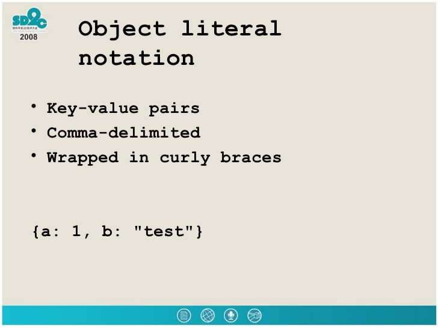

# Chapter 3 : Objects Literals
Objecst  set of variables and functions to creat a module of something you would recognize from real world.
In object proparities to tell us about the object.

* Functions (Methods) represent tasks associated with object.
* Key is the Name and value for methods and proparites.
* objects **can't** have two key with the same name .

the *Value* of a proparty can be anything , but Methods value always must be function
## When declaring an Object??
1. We put the object in curly braces .
2. treat values like for variables.
3. separte each proparty and method with commas.
4. Separate each key from its value using a colon
5. to access a properties or methods of an object using dot notation.
6. to access proparites using square brackets.
7. we use the name fo the object followed by a period then the name of the project, to access proparity or method of an object.
**Note** : we can also access proparties by writing the object name and put the propaiteis between square bracits.

**Example**

# Chapter 5: Document Object Module

The document Object Model (DOM) explain how browsers should create a model of an HTML page and how JavaScript can access and update the contents of a web page while it is in the browser window.

* (DOM)  is a separate set of rules, it is implemented by all major browser makers, and covers two primary areas: 
1.Making a module of HTML page by using a DOM tree. 
2.Acessing and changing HTML page.
* The DOM states what your script can “ask the browser about the current page, and how to tell the browser to update what is being shown to the user.
* what is the The DOM tree?
 it is a moudle of web page it consists of four parts

1. THE DOCUMENT NODE (it represent the entire page).
2. ELEMENT NODES.
3. ATTRIBUTE NODES.
4. TEXT NODES.
**every node is a descendant of the document node**
## Accessing and updating the DOM tree 

**how we can Accessing and updating the DOM tree?**

*by doing two steps:* 

1. Locate the node that represents the element you want to work with.

* select indivisual elment node : `getElemetnById()`, `querySe1ector()`.

* select multiple element : `getElementByClassName()`, `getElementsByTagName()`,`querySelectorAll()`.

* traversning between elements: `firstChild` , `lastChild`. 

2. Use its text content, and attributes, child elements. 

* Cashing DOM queries.

**what is the queries?**

*queries* are methods that find elements in the DOM tree.

queries return one element, or they may return a Nodelist. 
**Nodelist** is a collection of nodes , so when a method returns more than one node, and always return a Nodelist, which is a collection of nodes even if it only finds one matching element.

Finding the quickest way to access an element within your web page will make the page seem faster and/or more responsive.

to select indivisual elements we use this methods  : `getElementById()` ,`querySelector()`.
to selcting an elment from a Nodelist : ` item()`, array synatx.
repeating actions for an entir nodelist : Loop through every node in the collection and apply the same statment to each.

**adding or removing HTML content:**
* the innerHTML proparty
* DOM manipulation methods -From an element node, you can access and update its content using properties such as `textContent` and `innerHTML` or using DOM manipulation techniques.
* Browsers offer tools for viewing the DOM tree
* browsers, implementation of the DOM is inconsistent, and is a popular reason for using jQuery.
* the element node can contain multiple text nodes and child elements that are siblings of each other.