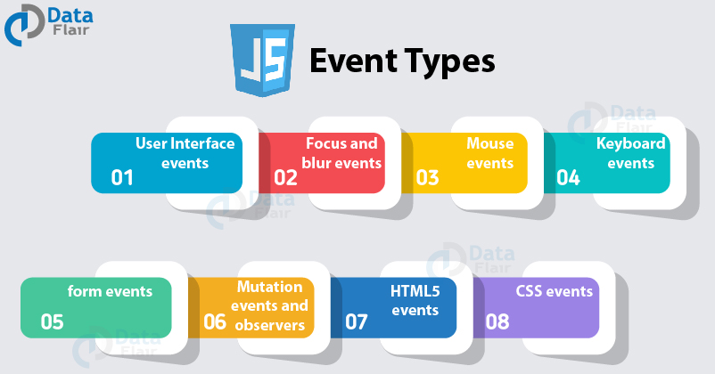

# Forms
There are many uses of forms among the internet, they are used to enable users to add information such as signing in, choosing between choices, or even to search on the web. How control forms are used: The user adds information and submits them to the server, then the name of the control along with the information from the user is sent to the server, after that the server processes the information using programming language and some of these information will be saved in the database, finally the server creates a new page according the input and sends it to the user. The form may have several form controls, each gathering different information, the server needs to know which piece of inputted data corresponds with which form element. 

**How we can make forms?**

the form control is included inside a `< form >` element, that element must have an attribute called `action`, this attribute carries the URL of the page and receiving the information.

**two method can be used to perform the form:**
**get method**, the value from the form are added to the end of the URL specified in the action attribute. 
this method is ideal for:
Short forms (such as search boxes).

When you are just retrieving data from the web server (not sending information that should be added to or deleted from a database).

with the **post method** the values are sent in what are known as HTTP headers. 
you should use the post method if your form:
1. Allows users to upload a file.
2. It is very long.
Contains sensitive data like password.

Adds information to, or deletes information from a database. 
If the method attribute is not added, the data will be sent using the get method. 
* Types and uses of forms:

**Adding text:**

**Password input**, one-line input that masks the text inside it, it is added using type=password attribute, and also the name and the maxlength attributes.

* Text area, used for long texts such as comments, used by adding the `<textarea>` element.

**Text input**, usually used in small texts such as sign in information, it is added type= textattribute, name attribute to put the name of the input, and maxlength to set the maximum characters can be added to the form.

**Making choices:**

**Dropdown boxes**, the user picks the option from a dropdown menu, here the tag is < select > and the name attribute is added to it, and to add options we use < option > tag that has value and selected attributes.

**Radio buttons** used when the user is asked to choose one option of multiple options, added using the type=radio and also the name attribute, but here we add a value that the user will choose and its information will be sent to the server, and checked attribute to indicate which value should be selected when the page loads.

**Checkboxes** here the user can choose more than one option, the attributes are type=checkbox, name, value, checked.

**Submitting forms:**

**Submitting image**, same as submitting button, but here you can use an image, here we use < input > tag and type=image attribute.

**Uploading files** allows user to upload a file to the web, we use `<input>` tag and type=file attribute.
**submitting button** to submit data from your form to another web page, we use the tag `<input>` and name and value attributes.

## Events

The browser use events to indicate when something has happened in it.

**Event flow**

HTML elements nest inside other elements, so when hovering or clicking on a link, it is like hovering and clicking on the parent elements. 

**There are two types of event flow:**

**EXAMPLE**

1. **Event bubbling**the event starts at the *most* specific node then flows outwards to the least specific one, that is the default flow.

2. **Event capturing** the event starts at the *least* specific, then flows inwards to the most specific.

* Binding is the process of stating which event you are waiting to happen, and which element you are waiting for that event to happen upon.

* The most commonly used events are W3C DOM events, although there are others in the HTMLS specification as well as browser-specific events.

* When an event occurs on an element, it can trigger a JavaScript function. 

* You can use event delegation to monitor for events that happen on all of the children of an element.

* When this function then changes the web page in some way, it feels interactive because it has responded to the user.
