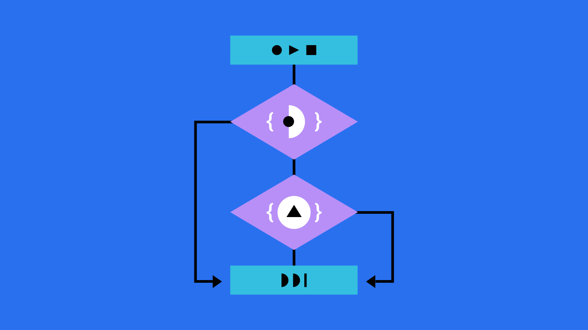
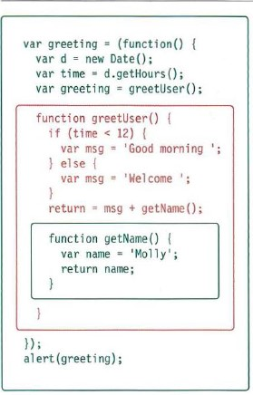
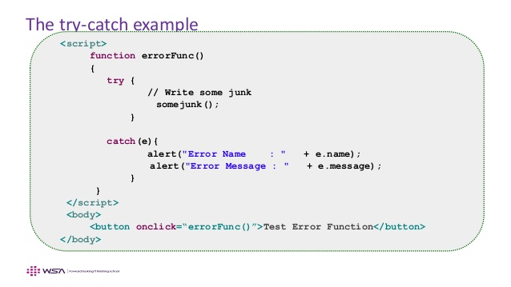

# chapter 10 : Error Handling & Debugging

* order of execution: to find the source of an error, it helps to know how scripts are processed.

* execution context: JavaScript interpreter uses the concept of execution contexts, there is one global execution context, each function creates a new execution context, they correspond to variable scope.

* Every statement in a script lives in one of three execution contexts:
1. GLOBAL CONTEXT
Code that is in the script, but not in a function, There is only one global context in any page.

2. FUNCTION CONTEXT
Code that is being run within a function, Each function has its own function context.

3. EVAL CONTEXT 
Text is executed like code in an internal function.

* EXECUTION CONTEXT AND HOISTING:

when script enters a new execution context, there are two phases
of activity:
1. PREPARE: (The new scope is created) + (Variables, functions, and arguments are created) + (The value of the this keyword is determined).

2. EXECUTE
(Now it can assign values to variables) + (Reference functions and run their code) + (Execute statements).

* The preparation phase is often described as taking all of the variables and functions and hoisting them to the top of the execution context, or as having been prepared.

* Each execution context also creates its own
variab1es object, and this object contains details of all variables, functions, and parameters for that execution context.

**Scopes**
The execution context has its own variables object, so it holds the variables, functions, and parameters available within it.

* execution context can also access its parent's variables object.

## Error objects:

Error objects can help you find where your mistakes are and browsers have tools to help you read them. When an Er ror object is created, it will contain the following properties:

1. name of the error

2. file number

3. line that hold the error

* When there is an error, you can see all of this information in the JavaScript console of the browser.

## Debugging:

the process that involves finding errors and removing them from your program.

Before solving the error we have to know the root cause of that error. Errors can result from:

Including language features or syntax that the scripting engine does not support within the script.

Failing to correctly implement the intent of the program or some particular algorithm. This occurs when, although code is syntactically correct and does not generate any errors, it produces behavior or results other than those you intend.

Including components that contain bugs themselves. In this case, the problem lies with a particular component, rather than with your script, which “glues” the components together.

After you find the cause of the error , you can solve it simply by searching online for the best solution based in your code functionality.

**Example for try and catch methods:** 

