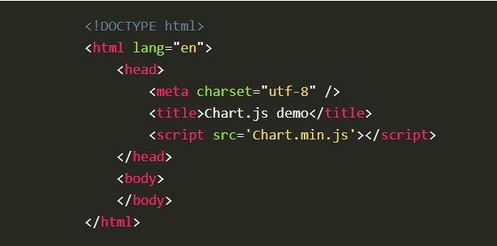
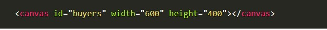
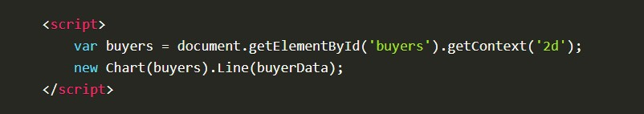

# Charts :

Charts are far better for displaying data visually than tables, they’re easier to look at and convey data quickly, but they’re not always easy to create!

 **Chart.Js** JavaScript plugin that uses HTML5’s canvas element to draw the graph onto the page. It’s a well documented plugin that makes using all kinds of bar charts, line charts, pie charts and more, incredibly easy.
 **it’s simple to use and really very flexible**

 * to start up with chart.js, it's easy to get started with Chart.js. all that's required is the script included in your page along with a single `<canvas>` node to render the chart.

 

 
 * create the canvas element in HTML

 

 * retrieve the context of the canvas

 

* Installation: **"Chart.js"** can be installed via npm or bower, It is recommended to get Chart.js this way.

* Selecting the Correct Build
**Chart.js** provides two different builds for you to choose: 

1. Stand-Alone Build

Files: (dist/Chart.js, dist/Chart.min.js)

* stand-alone build includes Chart.js as well as the color parsing library. If this version is used, you are required to include Moment.js before Chart.js for the functionality of the time axis.

2. Bundled Build

Files: (dist/Chart.bundle.js, dist/Chart.bundle.min.js) 

* this includes Moment.js in a single file. You should use this version if you require time axes and want to include a single file. You should not use this build if your application already included Moment.js. Otherwise, Moment.js will be included twice which results in increasing page load time and possible version compatibility issues

* what is the Moment.js?

version in the bundled build is private to Chart.js so if you want to use Moment.js yourself, it's better to use Chart.js (non bundled) and import Moment.js manually.

* Integration:

Chart.js can be integrated with plain JavaScript or with different module loaders.

* Content Security Policy:

By default, Chart.js injects CSS directly into the DOM. For webpages secured using Content Security Policy (CSP), this requires to allow style-src 'unsafe-inline', For stricter CSP environments, where only style-src 'self' is allowed.

* general configuration: 
options that can apply elsewhere in the documentation like:  

1. *Responsive* defines responsive chart options that apply to all charts.

2. *Device Pixel Ratio* defines the ratio between display pixels and rendered pixels.

3. *Interactions* defines options that reflect how hovering chart elements works.

4. *Options* scriptable and indexable options syntax.

5. *Colors* defines acceptable color values.

6. *Font* defines various font options.

7. *Performance* gives tips for performance-sensitive applications.

* Chart.js comes with built-in chart types:line, bar, radar, doughnut and pie, polar area, bubble, scatter.
